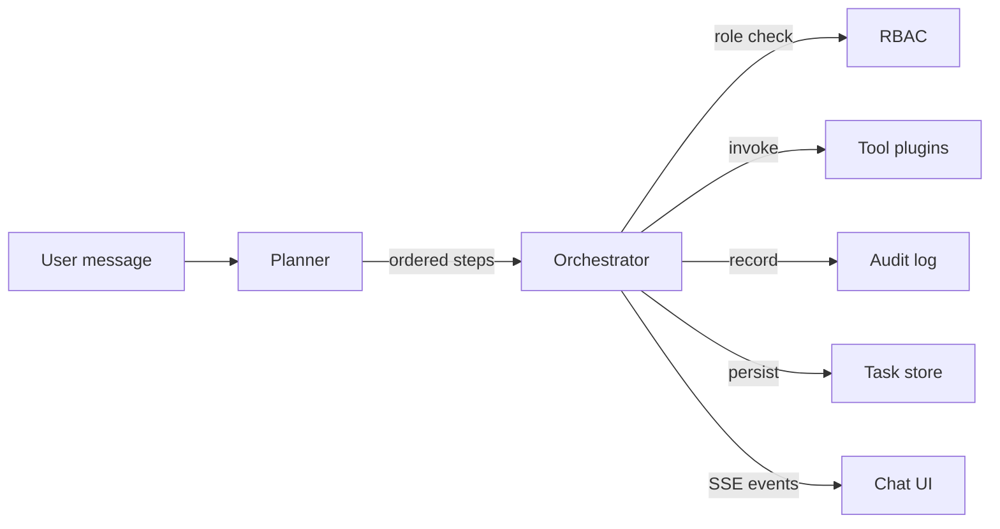

# Architecture — Enterprise Task Agent

## Overview

The Enterprise Task Agent is a **tool-using agentic system**. A natural-language
request is turned into an ordered **plan**, each step is checked against
**RBAC**, executed by a **tool plugin**, recorded in an **audit trail**, and
streamed back to the UI in real time.

## Components

| Component | Path | Responsibility |
|-----------|------|----------------|
| **Config** | [app/config.py](../app/config.py) | Environment-driven settings; selects planner mode |
| **Schemas** | [app/agent/schemas.py](../app/agent/schemas.py) | Pydantic contracts for requests, steps, task runs |
| **Planner** | [app/agent/planner.py](../app/agent/planner.py) | Message → ordered `PlannedStep`s (rule-based or LLM) |
| **Orchestrator** | [app/agent/orchestrator.py](../app/agent/orchestrator.py) | Executes steps, enforces RBAC, audits, streams events |
| **Tools** | [app/tools/](../app/tools) | Pluggable capabilities (desk, timesheet, leave, IT, approval) |
| **RBAC** | [app/core/rbac.py](../app/core/rbac.py) | Hierarchical role checks |
| **Audit** | [app/core/audit.py](../app/core/audit.py) | Append-only, redacted action log |
| **Store** | [app/core/store.py](../app/core/store.py) | In-memory task-run history |
| **API** | [app/api/routes.py](../app/api/routes.py) | REST + SSE endpoints |
| **UI** | [frontend/](../frontend) | No-build chat client with live status |

## Request flow

1. **Plan** — `planner.plan()` returns ordered steps. With `LLM_PROVIDER` set,
   it asks an LLM for a JSON plan and falls back to rules on any error.
2. **Authorize** — each step's tool declares a `required_role`; the orchestrator
   checks it via `rbac.can_use()`. Denied steps are recorded and skipped.
3. **Execute** — the tool's `run()` returns a `ToolResult`.
4. **Audit** — every attempt (completed / failed / denied) is appended with
   sensitive params redacted.
5. **Stream** — the SSE endpoint emits `plan`, `step_started`, `step_finished`,
   and `done` events for progressive UI updates.

## API surface

| Method | Path | Purpose |
|--------|------|---------|
| GET | `/api/health` | Liveness + planner mode |
| GET | `/api/tools` | Tool catalog (manifests) |
| POST | `/api/chat` | Synchronous plan + execute → `TaskRun` |
| GET | `/api/chat/stream` | SSE progressive execution |
| GET | `/api/tasks` | Task-run history |
| GET | `/api/audit` | Redacted audit trail |

## Extending the agent

Add a new capability in three steps:

1. Create `app/tools/my_tool.py` subclassing `Tool` and implementing `run()`.
2. Register it in `app/tools/__init__.py` (`_TOOL_CLASSES`).
3. Add detection keywords in `app/agent/planner.py` (or rely on the LLM planner).

No other layer changes — the orchestrator, RBAC, audit, and UI pick it up
automatically.

## Design choices

- **Offline-safe by default** — deterministic mock tools + rule-based planner so
  a live demo never depends on network or API keys.
- **Graceful LLM fallback** — real AI when configured, rules when not.
- **Governance-first** — RBAC and audit are part of the execution path, not an
  afterthought.
- **Zero-build frontend** — plain HTML/CSS/JS served by FastAPI; nothing to
  compile for the demo.
